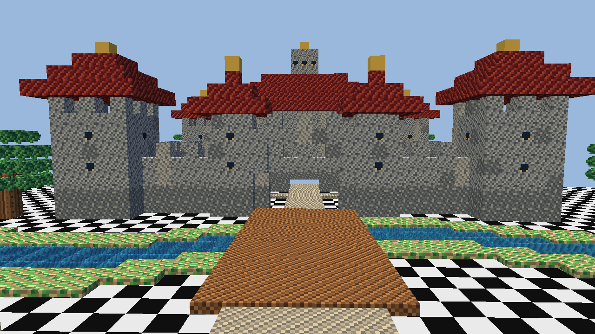
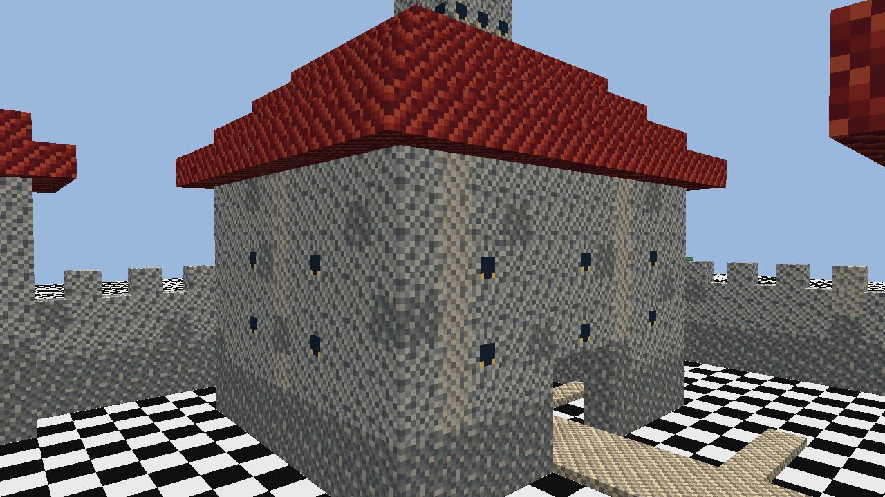
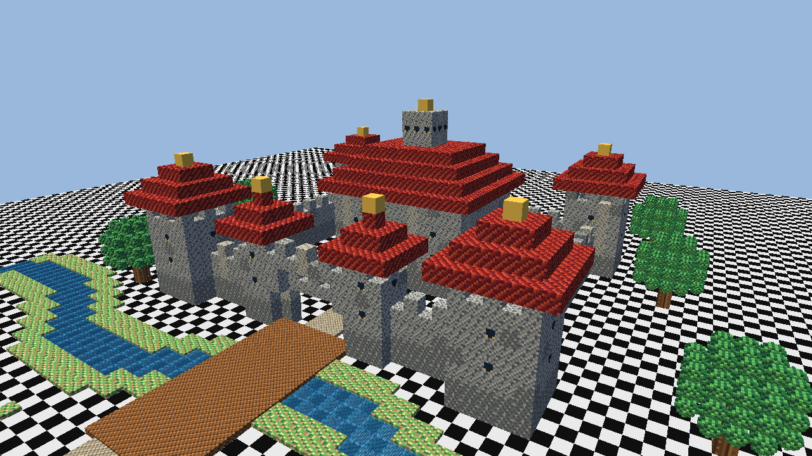

# neko-mouse-world

Voxel-based cubic world editor built from reusable `.box` files created with
`box-editor-view`.

## Showcase

The repository includes a generated castle world at `examples/castle_showcase`.
It demonstrates a large editable scene made from a small set of reusable `.box`
assets: a stone castle, towers, a bridge, a stream, trees, paths, windows, and
layered roofs.







Open the showcase world in single-player mode:

```powershell
venv\Scripts\python.exe -m neko_mouse_world.server examples\castle_showcase --with-client
```

The showcase can be regenerated and re-captured with:

```powershell
venv\Scripts\python.exe tools\generate_castle_showcase.py
venv\Scripts\python.exe tools\capture_showcase_screenshots.py
```

## Run

Use the project virtual environment:

```powershell
venv\Scripts\python.exe -m neko_mouse_world.server path\to\world-folder --host 127.0.0.1 --port 5678
venv\Scripts\python.exe -m neko_mouse_world.client --host 127.0.0.1 --port 5678
```

If the client is started without `--host` and `--port`, it opens a modal
connection dialog first. Fill in the server host and TCP port, then press OK.

The world path is a folder. When `info.world` or `boxes/` is missing, the editor
creates them automatically. If `info.world` exists but is malformed, startup
prints `FormatError` and exits.

For single-player convenience, run the server with a main local client:

```powershell
venv\Scripts\python.exe -m neko_mouse_world.server path\to\world-folder --with-client
```

In `--with-client` mode the server runs in the background, launches one client
connected to itself, and shuts down when that main client exits.

The server accepts `--udp-host` and `--udp-port`. The default UDP port is `0`,
which means the OS chooses a free port. The selected UDP endpoint is negotiated
over TCP. World/map changes always use TCP. Player positions first try UDP; the
client sends 5 probe packets and UDP is used only when at least 3 probes succeed.
If the test fails, player positions automatically fall back to TCP.

During startup, the main TCP connection receives the world snapshot and an asset
manifest. Missing `.box` assets are then downloaded over temporary parallel TCP
channels that share the same client UUID and startup token. The temporary
channels close after startup, leaving only the main TCP connection. Configure
the count with `--startup-asset-channels`; use `1` to effectively disable
parallel startup asset transfer. If those temporary channels fail, the client
reconnects and falls back to inline asset transfer on the main TCP connection.

The server saves world changes immediately. When the last client disconnects, it
also removes `.box` files from `boxes/` that are no longer referenced by the
world.

When a client first connects to a server, it shows a loading progress bar while
preparing reusable `.box` meshes, collision hulls, and world chunks over multiple
frames. Later reconnect snapshots are synchronized in the background without
showing the first-load progress overlay again.

## World Format

`info.world` is a SQLite database containing the world grid. Each occupied world
cell stores the content hash of a `.box` file plus an `orientation` value from
`0..23`. The hash identifies the reusable shape; the orientation only rotates
that instance. The corresponding file is loaded from:

```text
boxes/<hash>.box
```

The hash is the same stable digest printed by:

```powershell
venv\Scripts\python.exe -m box_editor_view --hash some.box
```

If `info.world` references a missing `.box` file, that world cell is removed on
load and the repaired world file is saved.

`.box` color alpha follows `box-editor-view`: alpha `0` is not empty. It is
rendered as an opaque RGB cube and acts as an RGB-colored point light source.
The client keeps realtime point lighting capped to nearby/in-view light cubes;
far or off-screen light cubes still render as opaque RGB cubes. Alpha `1..254`
is transparent, and alpha `255` is opaque.

## Controls

- Mouse look after the mouse is captured.
- `WASD`: move.
- `F`: switch walk and fly modes.
- Walk mode `Space`: jump 1.1 world units.
- Fly mode `Space` / `Shift`: move up / down.
- Right click: place the selected `.box`.
- Left click: delete the targeted world box.
- `Z`: restore the last world box you deleted.
- Middle click: select the targeted world box type and orientation.
- `E`: edit the targeted world box in `box-editor-view`.
- Numpad `4` / `6`: rotate the targeted box around the player's view-up axis.
- Numpad `8` / `2`: rotate the targeted box around the player's view direction axis.
- `F2` or `Ctrl+S`: show save status; multiplayer worlds are saved by the server.
- `F5`: switch first-person / third-person view.
- `C`: look at the world-box centroid, or the origin when the world is empty.
- `~`: open the server command console.
- `H`: show help.
- `Esc`: release the mouse and show exit choices.

Placing, deleting, selecting, editing, and hover highlighting only work within
10 world units of the player.

World boxes collide using the convex hull of their `.box` voxel vertices, not a
full cube. In walk mode the player can step up onto obstacles up to 0.5 world
units high and follows convex slope surfaces.

The default placed object is the gray `N=0` single-cube `.box`.
